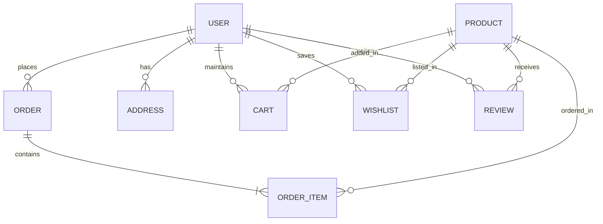

# Technical Architecture & System Design

High-level architecture documentation for the full-stack E-Kart e-commerce platform.

---

## Technical Stack Overview

```text
       ┌────────────────────────────────────────────────────────┐
       │                 React + Vite Frontend                  │
       └──────────────────────────┬─────────────────────────────┘
                                  │ HTTPS REST Calls
                                  ▼
       ┌────────────────────────────────────────────────────────┐
       │                   FastAPI Backend                      │
       │  (Security, Routers, ORM, Pydantic, BackgroundTasks)   │
       └──────┬───────────────────┬───────────────────┬─────────┘
              │                   │                   │
              ▼                   ▼                   ▼
     ┌─────────────────┐ ┌─────────────────┐ ┌─────────────────┐
     │  PostgreSQL DB  │ │   Redis Cache   │ │ Cloudinary CDN  │
     │  (Users, Orders)│ │ (Catalog, Cart) │ │ (Product Media) │
     └─────────────────┘ └─────────────────┘ └─────────────────┘
```

---

## Database ER Diagram (Entity Relationship)



---

## Core Components

1. **FastAPI Application (`main.py`)**: Central entry point registering CORS middleware, custom OpenAPI schemas, and 9 modular routers.
2. **Modular Routers (`routers/`)**: Isolated API endpoints for authentication, products, cart, wishlist, orders, address, admin, payments, and health.
3. **Database Layer (`db/`, `models.py`)**: SQLAlchemy declarative ORM models mapped to PostgreSQL.
4. **Cache & Security (`redis_client.py`, `core/security.py`)**: Redis-backed Cache-Aside pattern for ultra-low latency product catalog lookups and brute-force rate limiting.
5. **Asynchronous Tasks (`services/`, `tasks/`)**: FastAPI `BackgroundTasks` integrated with Brevo SMTP API for sending login alerts, order updates, and password resets without blocking API HTTP responses.
